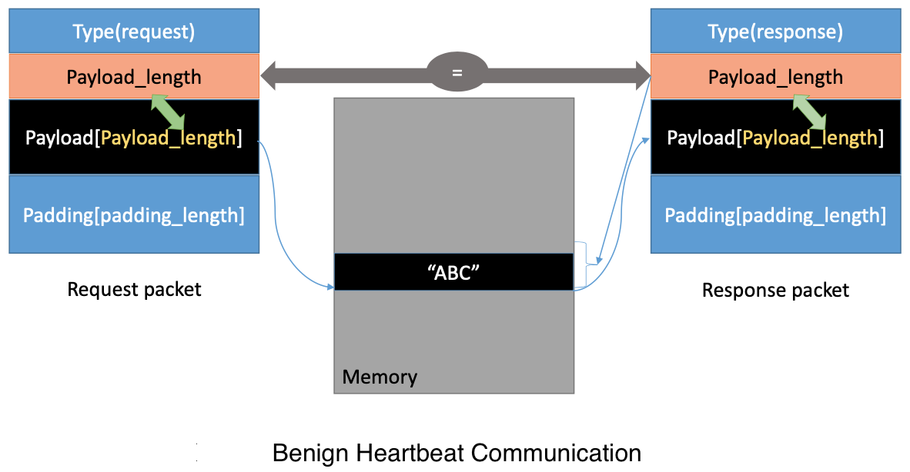
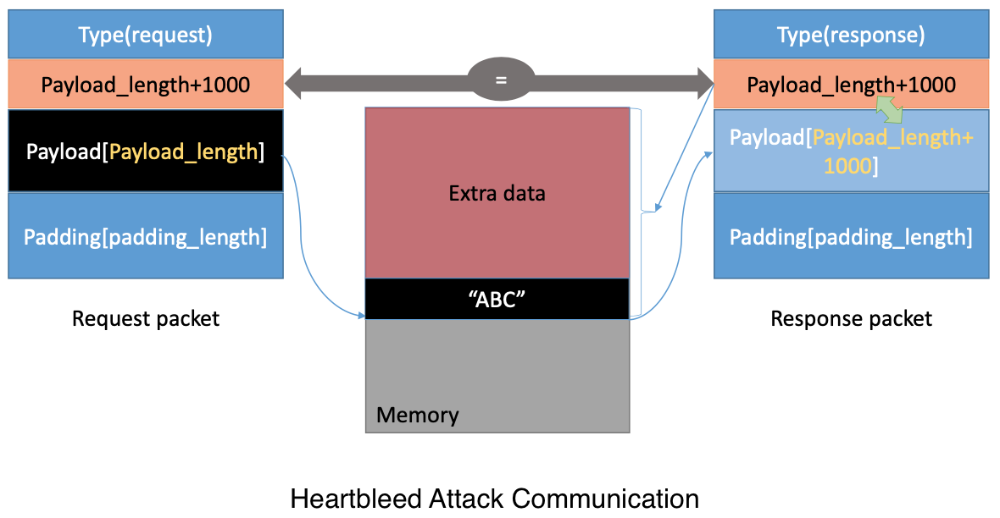

# Heartbleed

The Heartbleed bug (CVE-2014-0160) is a severe implementation flaw in the OpenSSL library, which enables attackers to steal data from the memory of the victim server. The contents of the stolen data depend on what is there in the memory of the server. It could potentially contain private keys, TLS session keys, usernames, passwords, credit cards, etc. The vulnerability is in the implementation of the Heartbeat protocol, which is used by SSL/TLS to keep the connection alive.

The affected OpenSSL version range is from 1.0.1 to 1.0.1f. The version in the Ubuntu VM is 1.0.1.

The Heartbleed attack is based on the Heartbeat request. This request just sends some data to the server, and the server will copy the data to its response packet, so all the data are echoed back. In the normal case, suppose that the request includes 3 bytes of data ”ABC”, so the length field has a value 3. The server will place the data in the memory, and copy 3 bytes from the beginning of the data to its response packet. In the attack svcenario, the request may contain 3 bytes of data, but the length field may say 1003. When the server constructs its response packet, it copies from the starting of the data (i.e. “ABC”), but it copies 1003 bytes, instead of 3 bytes. These extra 1000 types obviously do not come from the request packet; they come from the server’s private memory, and they may contain other user’s information, secret keys, password, etc.

<p align="center">
  
</p>

Next, change the length field of the request. First, let’s understand how the Heartbeat response packet is built from the figure above. When the Heartbeat request packet comes, the server will parse the packet to get the payload and the `Payload_length` value (which is highlighted above). Here, the payload is only a 3-byte string `"ABC"` and the `Payload_length` value is exactly 3. The server program will blindly take this length value from the request packet. It then builds the response packet by pointing to the memory storing `"ABC"` and copy `Payload_length` bytes to the response payload. In this way, the response packet would contain a 3-byte string `"ABC"`.

Next, launch the Heartbleed attack like what is shown in the figure below. Keep the same payload (3 bytes), but set the `Payload_length` field to 1003. The server will again blindly take this `Payload_length` value when building the response packet. This time, the server program will point to the string `"ABC"` and copy 1003 bytes from the memory to the response packet as a payload. Besides the string `”ABC”`, the extra 1000 bytes are copied into the response packet, which could be anything from the memory, such as secret activity, logging information, password and so on. 

The attack code allows the `Payload_length` value to change. By default, the value is set to a quite large one (0x4000), but it can reduced.

<p align="center">
  
</p>

The easiest way to fix the Heartbleed vulnerability is to update the OpenSSL library to the newest version. However, the objective is to patch the vulnerability via the source code.

**Format of the Heartbeat request/response packet**
```c
 struct {
    HeartbeatMessageType type;  // 1 byte: request or the response 
    uint16 payload_length;      // 2 byte: the length of the payload
    opaque payload[HeartbeatMessage.payload_length]; 
    opaque padding[padding_length];
} HeartbeatMessage;
````

The first field (1 byte) of the packet is the type information, and the second field (2 bytes) is the payload length, followed by the actual payload and paddings. The size of the payload should be the same as the value in the payload length field, but in the attack scenario, payload length can be set to a different value. The following code snippet shows how the server copies the data from the request packet to the response packet.

**Process the Heartbeat request packet and generate the response packet**
```c
/* Allocate memory for the response, size is 1 byte
 * message type, plus 2 bytes payload length, plus
 * payload, plus padding
*/

unsigned int payload;
unsigned int padding = 16; /* Use minimum padding */

// Read from type field first
hbtype = *p++; /* After this instruction, the pointer
                * p will point to the payload_length field */

// Read from the payload_length field from the request packet
n2s(p, payload); /* Function n2s(p, payload) reads 16 bits
                  * from pointer p and store the value 
                  * in the INT variable "payload". */

pl = p; // pl points to the beginning of the payload content

if (hbtype == TLS1_HB_REQUEST)
{
    unsigned char *buffer, *bp;
    int r;

    /* Allocate memory for the response, size is 1 byte
     * message type, plus 2 bytes payload length, plus
     * payload, plus padding
     */

    buffer = OPENSSL_malloc(1 + 2 + payload + padding);
    bp = buffer;

    // Enter response type, length and copy payload *bp++ = TLS1_HB_RESPONSE;
    s2n(payload, bp);

    // copy payload
    memcpy(bp, pl, payload);   /* pl is the pointer which
                                * points to the beginning
                                * of the payload content */
    bp += payload;

    // Random padding 
    RAND_pseudo_bytes(bp, padding);

    // this function will copy the 3+payload+padding bytes
    // from the buffer and put them into the heartbeat response
    // packet to send back to the request client side. 
    OPENSSL_free(buffer);
    r = ssl3_write_bytes(s, TLS1_RT_HEARTBEAT, buffer, 3 + payload + padding);
}
```

**The vulnerability lies here**
```c
// copy payload
memcpy(bp, pl, payload);
```
There is no check to determine if `pl` is valid or not. Therefore, a memory breach can occur.

Patches:
- Bounds checking before `memcpy()` is executed
- Server calculates packet size at runtime which requires additional overhead

> Patches were made in the VM but are not shown in this repo.

---

Thank you for your interest, this project was fun to work on!

